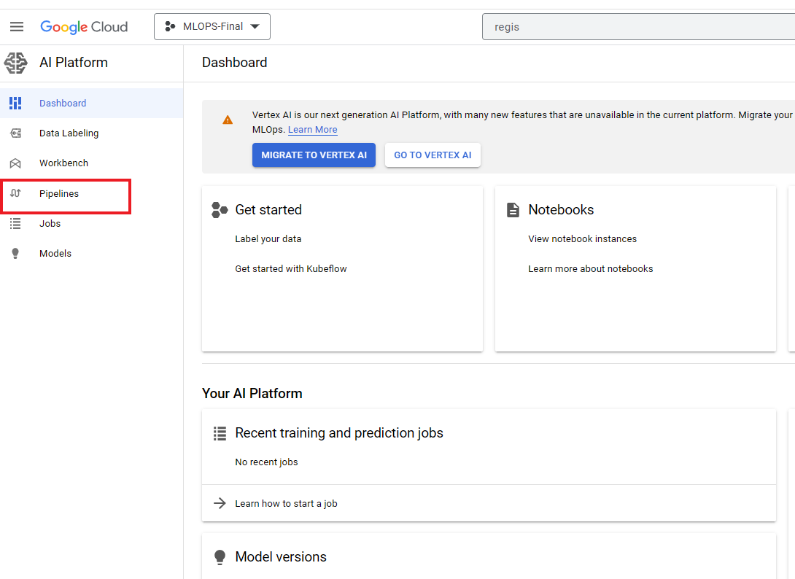
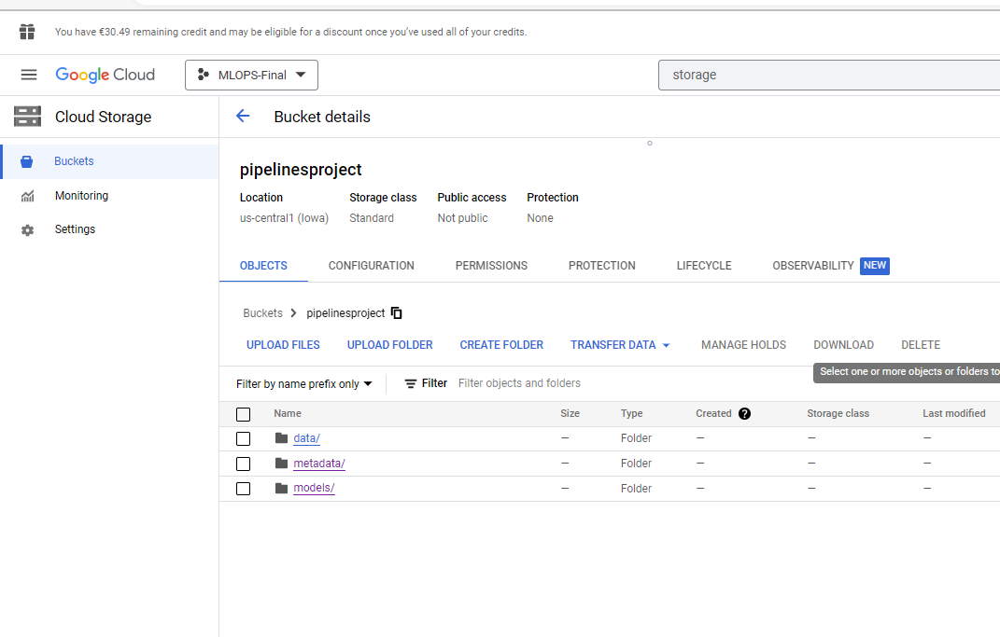
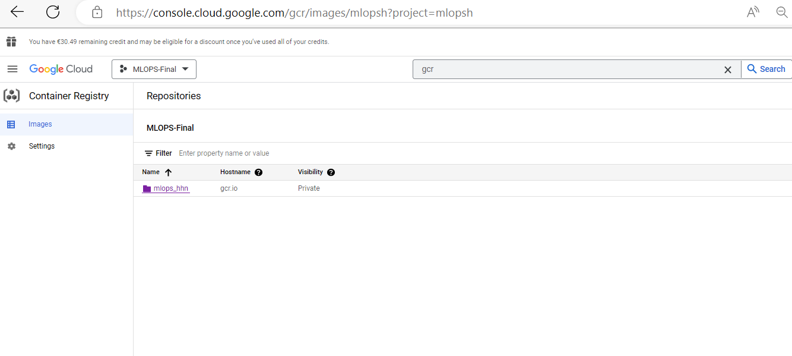
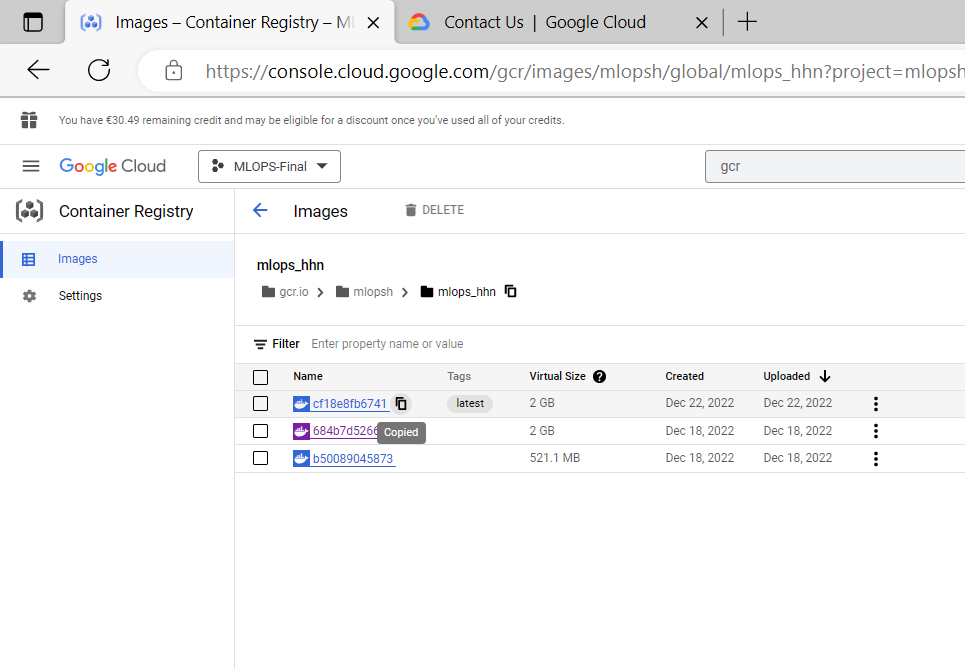
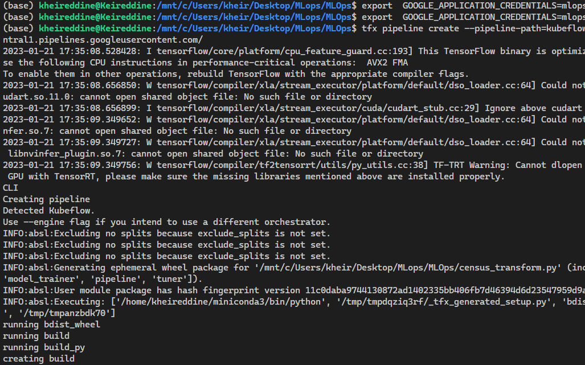

# Steps to produce this solution
## _MLOPS PROJECT 2022-2023_


### Purpose of this project

>Learn how to utilize Google Cloud to build a real-world machine learning pipeline, using the same techniques employed in large-scale projects.

## Requirements 
-  Linux distribution system (Ubuntu..) or you can use **WSL** if you have Microsoft Windows
-  Python 
-  TFX library 
-  Google clould Console
-  Docker 
-  Google Cloud Platform(GCP) Account
- Code Editor 

## Steps

### Prepare the Environment
#### Create GCP Project
- The first step is to install Docker on your pc because we are gonna to use docker to push our Docker image on google cloud registry. [Docker Instalation](https://docs.docker.com/engine/install/)
- The next step is one of the most important step in this  tutorial where we are going to create a [GCP](https://cloud.google.com/) Account.
  After creation you  GCP Account, we have to do some steps:
  - First of all we have to create a project, go now and click on that box  
  - After clicking on that box, a popup will appear like this one , click on "New Project"
  
  - After clicking on that project a new window will be open to put the data of you project in this situation you have only to put the name of you project like this:

   

   > Note : **we have complete now the creation of the project**

*** 

#### Activate services 

* In this step we are going to activate some service which are :
   - Google Cloud Registry (GCR)
   - Google cloud Storage
   - AI Platform 
   - Kubernets Engine

##### Google cloud Registry
> Google Cloud Registry (GCR) is a fully-managed, private Docker container registry that allows you to store, manage, and deploy Docker container images on Google Cloud Platform.

>To activate Google Cloud Registry (GCR) on Google Cloud Platform (GCP), you can follow these steps:

 **1.** Go to the GCP Console (console.cloud.google.com) and navigate to the Kubernetes Engine page.

 **2.** Select the project that you want to use for GCR. 

 **3.** In the left sidebar, click on "Container Registry" to access the GCR page.
 
 **4.** On the GCR page, click on "Enable" to activate the service.


##### Google cloud Kubernets 
So now we are going to create Kubernets cluster for our pipeline :
To create a Kubernetes cluster on Google Cloud Platform (GCP), you can use the Google Kubernetes Engine (GKE) service. Here are the general steps to create a cluster:

**1.** Go to the GCP Console (console.cloud.google.com) and navigate to the Kubernetes Engine page.

**2.** Select the project that you want to use for the cluster.

**3.** Click on the "Create Cluster" button.


***

**4.** After that  a pop up will appear. Choose the configure option for low cost


**5.** On the "Create a Kubernetes cluster" page, you will have several options to configure the cluster.
  - For this part of configuration we are not gonna do any thing,but you can give a name to you cluster if you want
  


*** 

 **6.** Now go `Default pool` section make sure that there is at least 3 nodes :
  
  


*** 
**7.** Now go to `Nodes` section where we are going to configure our nodes 
   - Make sure that you select **Ubuntu** as image for our node
   - The serie : **N1**
   - **Machine Type :** n1-standart-2(2 vCPu, 7.5GB memory) for low cost of money and it is enought for this project


***
**8.** Now go to `Security ` section where we are going to give the access to ower nodes to use the other google API Service:
   


> **Note**: After that, click on create 'This operation cloud take some time'

***

**9.** After the creation go back to the [Kubernets lists](https://console.cloud.google.com/kubernetes/list) you must see your cluster runing : 


### Install Google Cloud SDK
> The Google Cloud SDK is a set of tools for interacting with Google Cloud services through the command line

Download the Google Cloud SDK installer for your operating system from this link: [Google SDK Download](https://cloud.google.com/sdk/docs/install)

Run the installer and follow the prompts. This will install the gcloud command-line tool and other components of the SDK.

After installation, open a command prompt or terminal window and run the command gcloud init to initialize the SDK and set up your Google Cloud project.

If prompted, log in to your Google account (choose the google account that you create with you GCP Acount) and select the project you want to use with the SDK.

***
### Google Cloud AI Platform
- Now go to Goolge cloud [AI Platform](https://console.cloud.google.com/ai-platform) to create Kubeflow instance




***
- Now a new window appeared, click on create New instance


***

- Now a new window appeared, click on configure because we are going to configure the kubeflow depends on the nodes that we have been created previousily in [Kubernetes](#google-cloud-kubernets) section


  ***

- After clicking on  the Configure option button, a new window will appear, for this configuation we are gonna to choose the cluster that we are going to run our KubeFlow on, for that reason we will choose the cluster [Kubernetes](#google-cloud-kubernets) that we created in the previous steps. And then click on Deploy


 
> **Note**: This operation cloud take some time
***

- Now you can access to your KubeFLow instance by clicking on Open Pipeline Dashboard


***

- The dashboard will be something like this  
<br>


***

#### Get Access Token 
- To get access token to your Google cloud environment you have to go to [AIM and Admin](https://console.cloud.google.com/iam-admin) in order to get access token to  use it later with Goolge SDK

  **1.** First Step go to Service Account
  **2.** click on the action button that related to your project
  **3.** Click on message key


<br/>

<br/>

**4.** After clicking on messages keys a window will appear, next click on create new key. After creating the key, download it and save it because we are goinng to need it later.


***

### Google Storage  
* Before going to the  actions section we have to set our data that is gonna to  be used during our pipeline for that reason, I got data (free of charge) that you can use  during this tutorial. So you can [download](data.csv) this data. For that reason, you must have enabled your storage system first.For this project, we have three main folders: Data, where our raw data is stored; Model, where our trained models are saved; and Metadata, where the input and output of each stage of the pipeline are recorded and tracked.
  
     

 * So put the data that you have just downlowded in the data folder.

### Actions

#### Docker 
> Now we are going to upload the image on Google Cloud Registry, that  will be used at each stage of our pipeline.

> **Note**: you have to open this file [cloudbuild](cloudbuild.yaml) and change some parameters depends on you project name: 
> Now go to this line  [Line3]([cloudbuild.yaml#L3](https://github.com/KheireddineAzzez/MLOps/blob/cb60ce312e21abbc3cc71e7176ff83aafa83d2c0/cloudbuild.yaml#L3)) and  line  [Line5]([cloudbuild.yaml#L3](https://github.com/KheireddineAzzez/MLOps/blob/cb60ce312e21abbc3cc71e7176ff83aafa83d2c0/cloudbuild.yaml#L5)) and change this path "mlopsh/mlops_hhn" to the path of your project. because the  id of my project on Google cloud called mlopsh
> Example "Project_id/Your_path" 


To follow this step you must be already installed docker, because we are gonna build the docker image localy and uploaded on GCR.

* First of all check if you have already installed gcloud 
```sh
gcloud
```
* If gcloud is already intalled and assigned to your GCP account, you can start to push your image.
  
```sh
gcloud builds submit --config cloudbuild.yaml .
```
* So now go to your [GCR](https://console.cloud.google.com/gcr/images) page and you must see something like this
  
>**Note** : if you want to change the folder name of your image you can go here [CloudBUILD FILE](cloudbuild.yaml)
 


* In my case i will click on mlops_hhn to get the link of my image and for your case that will depends on your path. You must see some thing like this : 
  

* After copying the image link, now go to this file [Kubeflow_runner](kubeflow_runner.py) at [line16](https://github.com/KheireddineAzzez/MLOps/blob/cb60ce312e21abbc3cc71e7176ff83aafa83d2c0/kubeflow_runner.py#L16) in order to update the link that your kubeflow server will use to call the image at each stage of the pipeline and you are gonna to upadte the image that will be assigned to each stage of the pipeline.

***

### TFX commands
* For this part you must have already installed TFX, you can do this by running this code 
  
```python 
pip install TFX
``` 
* if the installation is done. You need now to get you [access token](#get-access-token) and put inside this project.
  
* TFX library is using the default variables of your system, however you have just to run this line of code in your comande line 

```python

export  GOOGLE_APPLICATION_CREDENTIALS="Access_Token_FILE".json  
```  
  
* After that run this code to upload your pipeline inside Kubeflow.
  
```python

tfx pipeline create --pipeline-path=kubeflow_runner.py --endpoint="Endpoint of your KubeFlowe Server" 
```
* As you can see TFX is converting your pipeline through using kfp and uploading it on Kubeflow.

  
